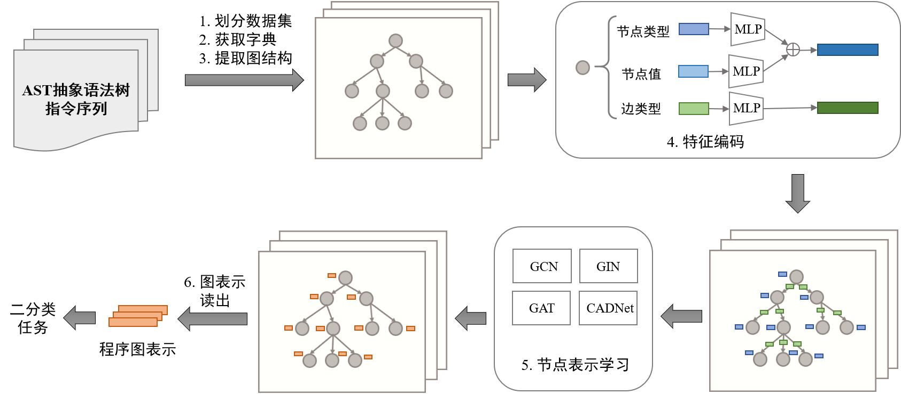

# 2022AMWD-WebshellDetection


## 整体框架



## 提交方案

`submit_version/`路径下是我们比赛时提交的镜像版本，因为有线上数据，所以无法直接运行。

其中config.json是我们的参数设置，对应含义及取值如下：
```c++
{
    "extract": true, //是否提取字典和图结构数据
    "eval": true, // 是否对训练集和验证集进行验证
    "batch_size": 32, //批处理大小
    "load": 0, // 用于读取已保存的模型，为0即从头开始训练
    "epochs": 50, // 迭代次数
    "gnn_type": "gin", // 使用图神经网络模型的类型
    "num_layer": 3, // 网络层数
    "edge_dim": 1, // 边的维度
    "emb_dim": 300, // 编码特征的大小
    "drop_ratio": 0.5, //dropout的比例
    "virtual_node": "False", // 是否使用虚拟节点
    "residual": "False", // 是否使用残差
    "JK": "sum", // 特征融合方式，可取"sum"或"last"
    "learning_rate": 0.001, // 学习率
    "device": 0, //设备，没有gpu则使用cpu
    "save_every_epoch": 10, //保存模型的频率
    "model_path": "model/", //模型保存位置
    "continues_fials":5, //早停机制的patience
    "last_pooling":"max" // 图读出层的方式，可取"max"，"sum"或"mean"
}
```

## 消融实验
`ablation_study/`路径下是报告中的消融实验的源码。

数据是官方给定的train.zip和train.csv, 如在本地运行，需要将zip文件解压后放入对应目录下的tctrain/train/，csv文件放入tctrain即可（和比赛提供的路径一致）。

### MLP
`ablation_study/mlp`: 使用MLP编码节点特征进行分类。
* mlp_split1.json和mlp_split2.json分别是按照4:1:1和4:1:50划分的数据集进行实验的参数。
* 进入模块， 运行`python main.py --config "mlp_split1.json" `即可，也可以自定义参数设置的json文件。
* statistic3.py用于统计最后的实验结果。

### Graph Convolution Network
`ablation_study/gcn`: 使用GCN模块进行分类。
* gcn_split1.json和gcn_split2.json分别是按照4:1:1和4:1:50划分的数据集进行实验的参数。
* 进入模块， 运行`python main.py --config "gcn_split1.json" `即可，也可以自定义参数设置的json文件。
* statistic.py用于统计最后的实验结果。

### Graph Attention Network
`ablation_study/gat`: 使用GAT模块进行分类。
* `configs/gat/split1`和`configs/gat/split2`分别是按照4:1:1和4:1:50划分的数据集进行实验的参数配置文件。
* 进入`ablation_study/gat`，运行`nohup ./run.sh > run.log 2>&1 &`
* 运行结果将分别附加输出到`configs/gat/split1/gat_split1_rslt.txt`文件和`configs/gat/split2/gat_split1_rslt.txt`文件中

### Adaptive aggregation with Class-Attentive Diffusion
`ablation_study/adaCAD`: 使用adaCAD模块进行分类。
* `configs/adaCAD/split1`和`configs/adaCAD/split2`分别是按照4:1:1和4:1:50划分的数据集进行实验的参数配置文件。
    * "vary_steps"文件夹下的不同配置文件中仅变化`Kstep_for_AdaCAD`这一参数，取值范围为[0,10]。用于探究不同的Kstep对模型效果的影响
    * "kstep4_beta0.8_embdim100"文件夹下的不同配置文件中变化`jk`和`pooling`两个参数。用于探究不同`JK`和`pooling`的选择对模型效果的影响。
* 进入`ablation_study/adaCAD`，运行`nohup ./run.sh > run.log 2>&1 &`
* 运行结果将分别附加输出到相应配置文件夹下的"...rslt.txt"文件中。

### Graph Isomorphism Network
`ablation_study/gin`: 使用GIN模块进行分类。
* `configs/gin/split1`和`configs/gin/split2`分别是按照4:1:1和4:1:50划分的数据集进行实验的参数配置文件。
* 进入`ablation_study/gin`，
    - 运行`nohup sh run1.sh > GinAblitionJK_Pool.log 2>&1 &` 对JK和Pooling参数进行消融实验
        * 运行结果将分别附加输出到`configs/gin/split1/gin_split1rslt.txt`文件和`configs/gin/split2/rslt.txt`文件中
    - 运行`nohup sh run2.sh > GinAblitionLayers.log 2>&1 &` 对Layer参数进行在split2最后的JK:max和pooling:sum的层数进行消融实验
        * 运行结果将附加输出到`configs/gin/split2/gin_split2_rslt.txt`文件中
        

## 画图
### plot_bar.py
* 将需要画图的数据放到`rslt_data`文件夹下。
* 运行`plot_bar.py`或`plot_curve.py`文件画图。注意指定结果数据文件。
* 注意，读入数据部分代码可能需要根据需要调试一下。

例如，
* gat不同jk+pooling组合结果画图：
    ```python
    python plot_bar.py --datafile gat_split1_vary_jk_pooling.txt --readtype gat
    python plot_bar.py --datafile gat_split2_vary_jk_pooling.txt --readtype gat
    ```
* gcn不同jk+pooling组合结果画图：
     ```python
    python plot_bar.py --datafile gcn_split1_vary_jk_pooling.txt --readtype gcn
    python plot_bar.py --datafile gcn_split2_vary_jk_pooling.txt --readtype gcn
    ```
* gin不同jk+pooling组合结果画图：
     ```python
    python plot_bar.py --datafile gin_split1_vary_jk_pooling.txt --readtype gin
    python plot_bar.py --datafile gin_split2_vary_jk_pooling.txt --readtype gin
    ```
* cad不同jk+pooling组合结果画图：
    ```python
    python plot_bar.py --datafile cad_split1_vary_jk_pooling.txt --readtype cad
    python plot_bar.py --datafile cad_split2_vary_jk_pooling.txt --readtype cad
    ```

### plot_curve.py

例如，
* gcn不同layer结果画图：
    ```python
    python plot_curve.py --datafile gcn_split2_vary_layers.txt --readtype gcn
    ```
* gat不同layer结果画图：
    ```python
    python plot_curve.py --datafile gat_split2_vary_layers.txt --readtype gat
    ```
* cad不同layer结果画图：
    ```python
    python plot_curve.py --datafile cad_split2_vary_layers.txt --readtype cad
    ```
* gin不同layer结果画图：
    ```python
    python plot_curve.py --datafile gin_split2_vary_layers.txt --readtype gin
    ```
